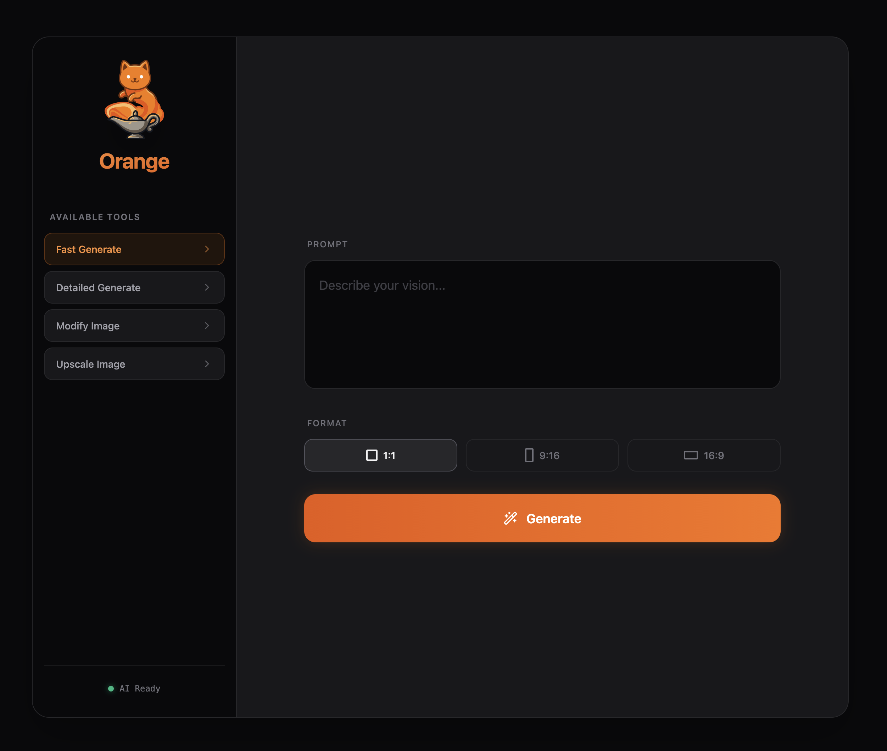

# Orange 🍊

Orange is a minimalist, dynamic web frontend wrapper around **ComfyUI**. It replaces the complex node-graph interface with a user-friendly, responsive experience that allows anyone to generate, edit, and upscale media via your local ComfyUI instance without knowing the node-spaghetti underneath.

## Features
- **Idiot-Proof UI**: Minimalistic design focused on clear inputs rather than backend complexity.
- **Dynamic Capabilities**: Tool availability and frontend UI adapt dynamically based on your configured workflows.
- **Real-Time Feedback**: Progress bars, queue positions, and system status directly inherited from ComfyUI websockets.
- **Extensible**: Simply drop in ComfyUI API workflows to add new generation paths.
- **Auto-Installer**: Simple `run.bat` and `run.sh` scripts manage the environment on Windows/Mac/Linux.

## Requirements
- Python 3
- A running instance of [ComfyUI](https://github.com/comfyanonymous/ComfyUI)

## Installation & Running

1. **Clone this repository**
2. **Double click `run.bat` (Windows) or execute `./run.sh` (Linux/Mac)**
   The startup script will automatically check for Python, install it if missing, create a virtual environment, install requirements, and start the frontend server on port `7070`.
3. Open your browser and navigate to `http://localhost:7070/`.

## Configuration
See the [Adding Workflows](docs/adding_workflows.md) guide to learn how to export your own ComfyUI node graphs and use them as new generation tools in Orange.

## Default Workflows
Out of the box, Orange is configured with these high-performance workflows:
- **Realistic Generate**: [Z-Image Turbo](workflows/image_z_image_turbo.json) + [NiceGirls UltraReal LoRA](https://civitai.com/models/1862761/nicegirls-ultrareal?modelVersionId=2465980)
- **Detailed Generate**: [Qwen 2512](workflows/Qwen%20Image%202512.json) using [BF16 Model](https://huggingface.co/Comfy-Org/Qwen-Image_ComfyUI/blob/main/split_files/diffusion_models/qwen_image_2512_bf16.safetensors) + [8-Step Lightning LoRA](https://huggingface.co/lightx2v/Qwen-Image-2512-Lightning/blob/main/Qwen-Image-2512-Lightning-8steps-V1.0-fp32.safetensors)
- **Modify Image**: [Klein KV](workflows/Klein%20Edit.json) (ComfyUI Default)
- **Upscale Image**: [SeedVR2 4k](workflows/SeedVR2%20Image%20Upscale.json) (From the [Seed2VR Extension](https://github.com/numz/ComfyUI-SeedVR2_VideoUpscaler))

## To Do
- [ ] LTX Video Support
- [ ] ACE Step Support
