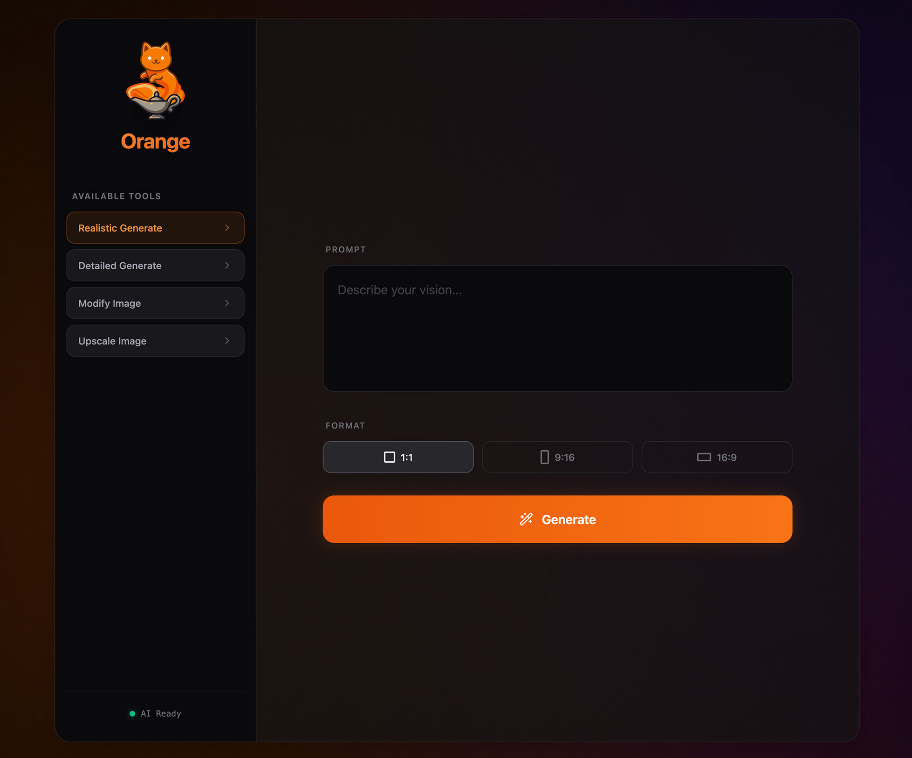
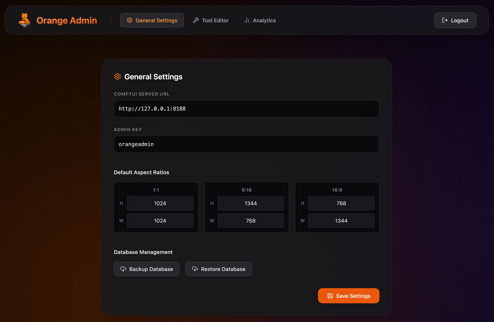
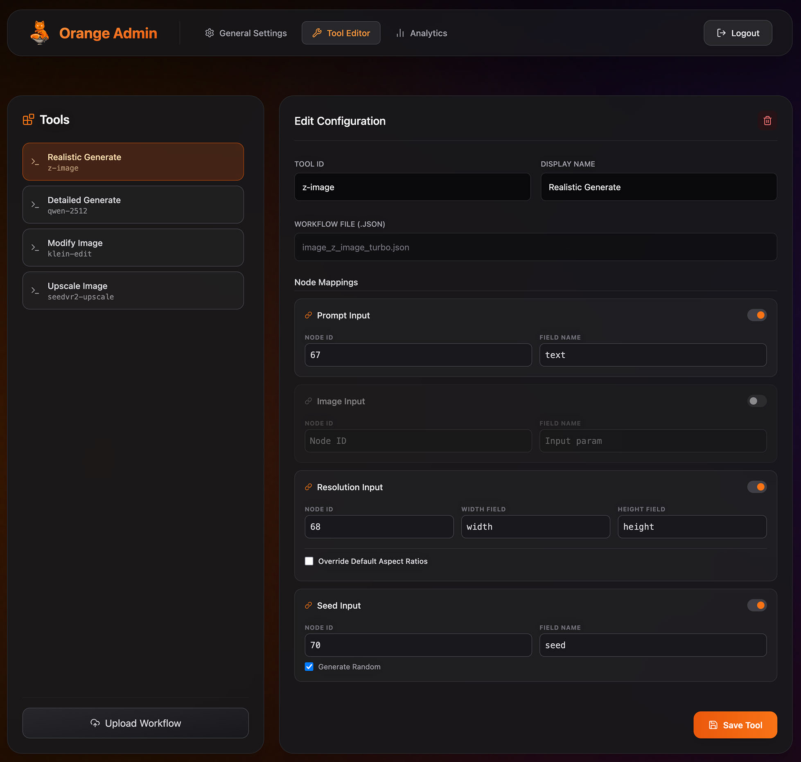
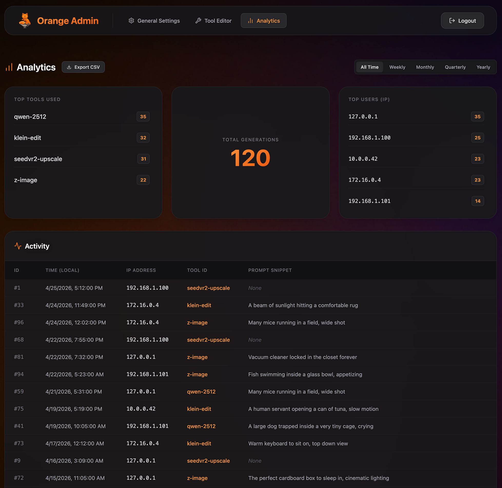

# Orange 😼

Orange is a minimalist, dynamic web frontend wrapper around **ComfyUI**. It replaces the complex node-graph interface with a user-friendly, responsive experience that allows anyone to generate, edit, and upscale media via your local ComfyUI instance without knowing the node-spaghetti underneath.

## Features
- **Idiot-Proof UI**: Minimalistic design focused on clear inputs rather than backend complexity.
- **Dynamic Capabilities**: Tool availability and frontend UI adapt dynamically based on your configured workflows.
- **Real-Time Feedback**: Progress bars, queue positions, and system status directly inherited from ComfyUI websockets.
- **Extensible**: Simply drop in ComfyUI API workflows to add new generation paths.
- **Auto-Installer**: Simple `run.bat` and `run.sh` scripts manage the environment on Windows/Mac/Linux.
- **Admin Tracking**: Secure built-in dashboard to monitor platform usage metrics, IPs, and tool popularity.

## Requirements
- Python 3
- A running instance of [ComfyUI](https://github.com/comfyanonymous/ComfyUI)

## Installation & Running

1. **Clone this repository**
2. **Double click `run.bat` (Windows) or execute `./run.sh` (Linux/Mac)**
   The startup script will automatically check for Python, install it if missing, create a virtual environment, install requirements, and start the frontend server on port `7070`.
3. Open your browser and navigate to `http://localhost:7070/`.

## Configuration
See the [Adding Workflows](docs/adding_workflows.md) guide to learn how to export your own ComfyUI node graphs and use them as new generation tools in Orange.

## Admin Dashboard

  
  
  

Orange features a secure analytics dashboard and an integrated Tool Editor that allows administrators to track usage metrics, manage workflows, and configure tools interactively.

1. Navigate to `http://localhost:7070/admin`.
2. Login using the `adminKey` defined in your `workflows-config.json` (defaults to `orangeadmin`).

### Tool Editor Features
- **Workflow Uploads**: Drag and drop ComfyUI API JSON workflows directly into the browser to automatically parse them. Orange will intelligently map your Prompt, Image, Resolution, and Seed inputs based on common nodes (e.g., `CLIPTextEncode`, `LoadImage`).
- **Node Mappings**: Manually bind frontend UI elements (Prompt input, Image dropzone) to specific ComfyUI node IDs.
- **Resolution Overrides**: Configure tool-specific output dimensions (1:1, 16:9, 9:16) for workflows that deviate from the global defaults, or turn off resolution scaling entirely.

## Default Workflows
Out of the box, Orange is configured with these high-performance workflows:
- **Realistic Generate**: [Z-Image Turbo](workflows/image_z_image_turbo.json) + [NiceGirls UltraReal LoRA](https://civitai.com/models/1862761/nicegirls-ultrareal?modelVersionId=2465980)
- **Detailed Generate**: [Qwen 2512](workflows/Qwen%20Image%202512.json) using [BF16 Model](https://huggingface.co/Comfy-Org/Qwen-Image_ComfyUI/blob/main/split_files/diffusion_models/qwen_image_2512_bf16.safetensors) + [8-Step Lightning LoRA](https://huggingface.co/lightx2v/Qwen-Image-2512-Lightning/blob/main/Qwen-Image-2512-Lightning-8steps-V1.0-fp32.safetensors)
- **Modify Image**: [Klein KV](workflows/Klein%20Edit.json) (ComfyUI Default)
- **Upscale Image**: [SeedVR2 4k](workflows/SeedVR2%20Image%20Upscale.json) (From the [Seed2VR Extension](https://github.com/numz/ComfyUI-SeedVR2_VideoUpscaler))

## To Do
- [ ] Video Support
- [ ] Audio Support
