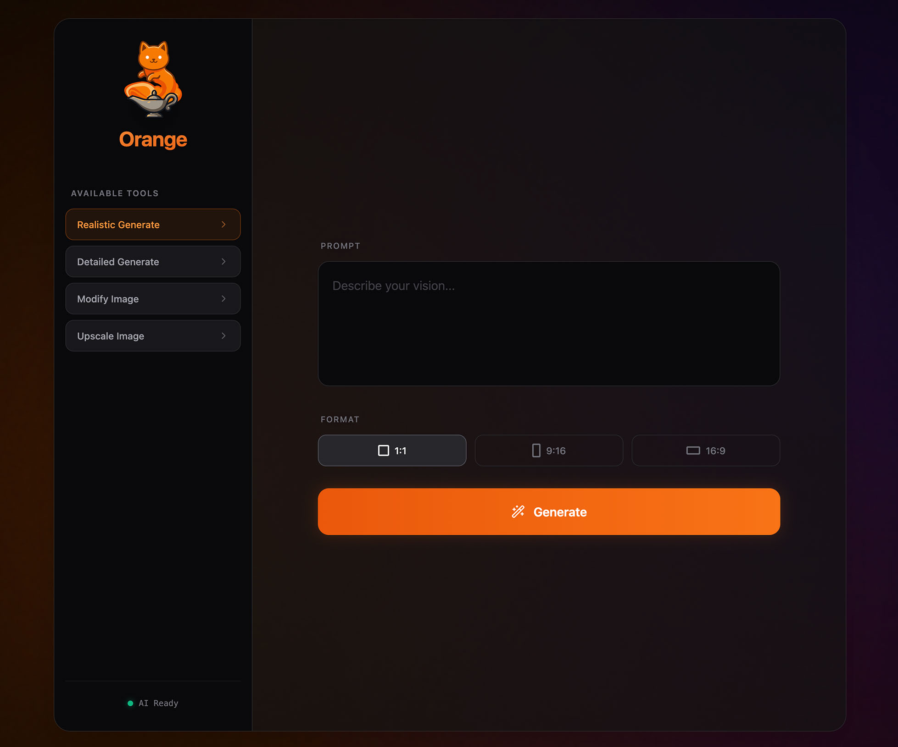
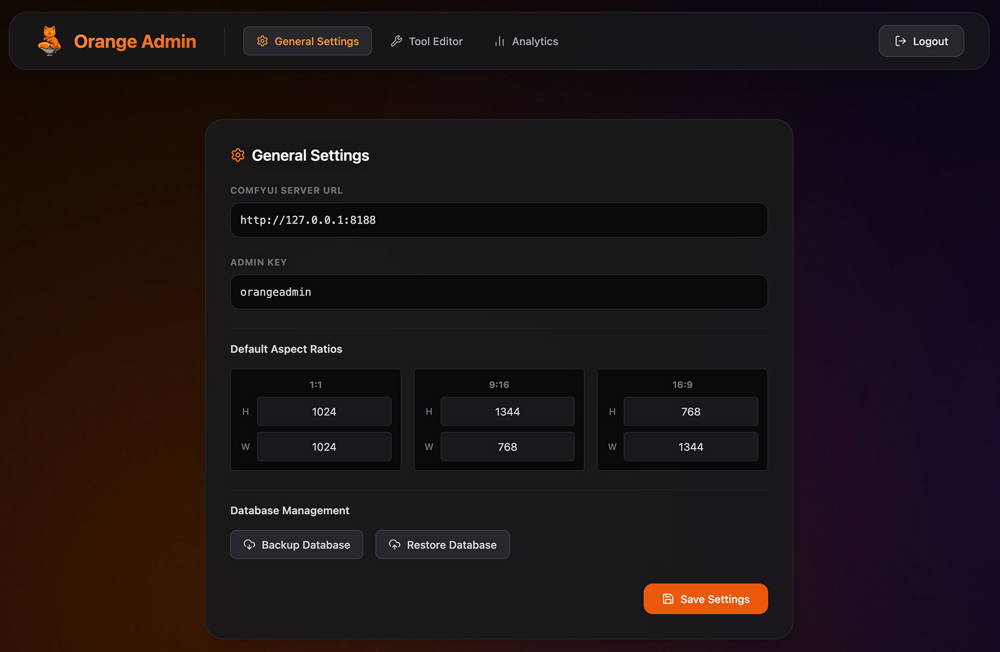
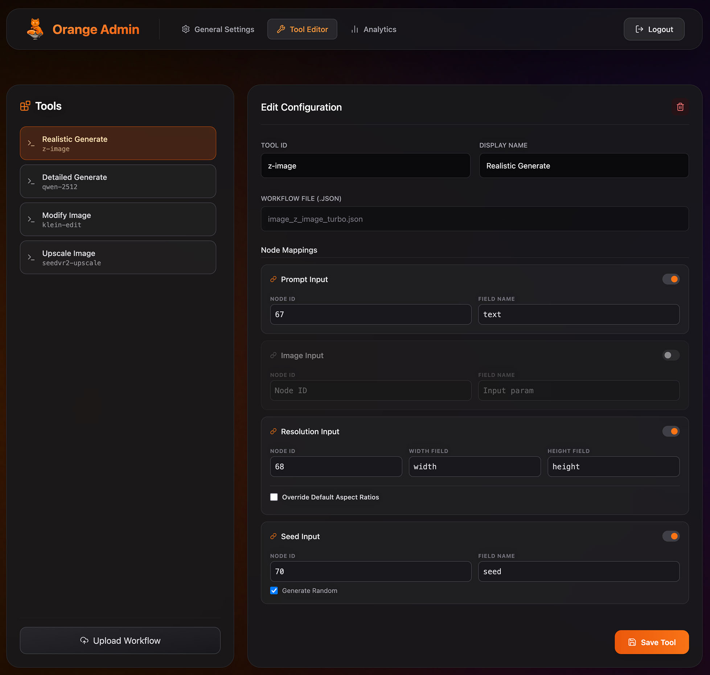
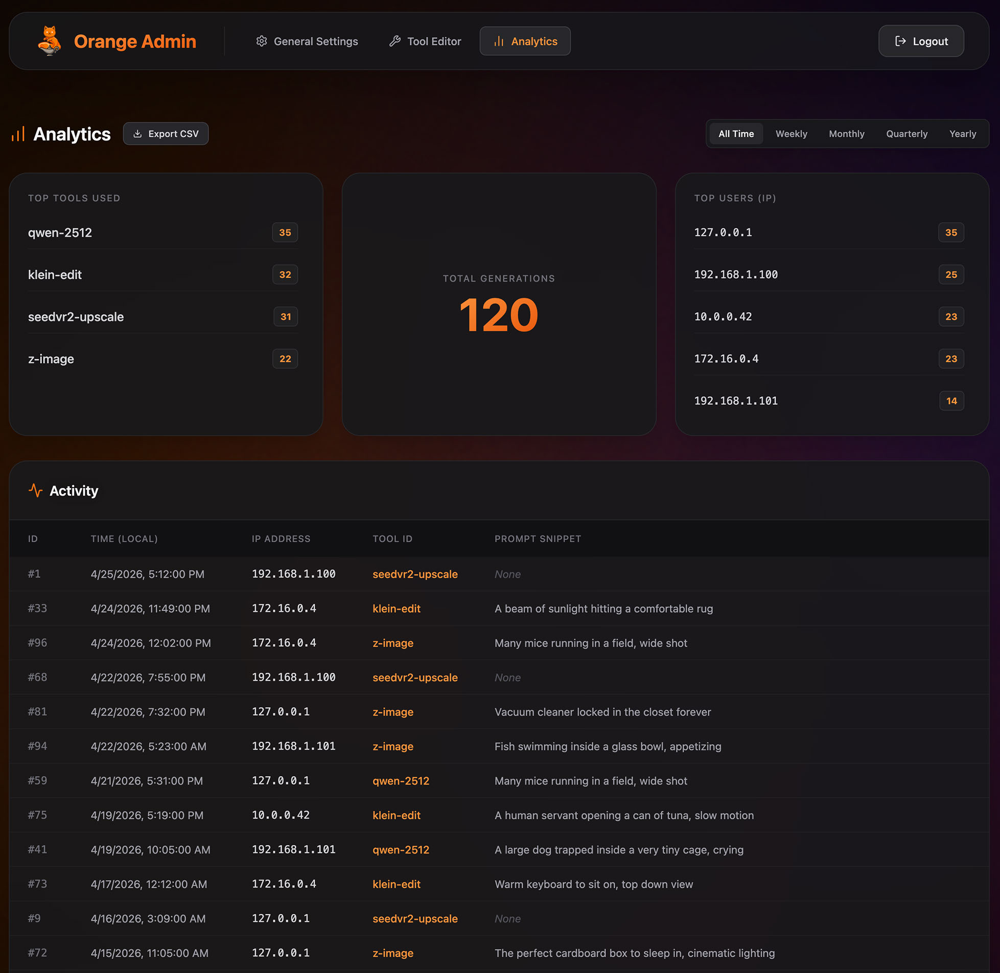

# Orange 😼

Orange is a minimalist web frontend for **ComfyUI**. It turns engineer-built API workflows into simple generation tools without exposing the node graph, model plumbing, or backend fleet to ordinary users.

## Design Philosophy

Orange is intentionally **not** a generic ComfyUI parameter editor.

The workflow author owns the complicated parts: models, samplers, steps, CFG/guidance, LoRAs, conditioning, custom nodes, and other implementation details. Orange should expose only the choices a user genuinely needs for that generation, typically:

- prompt
- image/reference image when required
- an intentionally curated aspect ratio/resolution
- Generate

`nodeMapping` is a curated product API, not a list of technical controls waiting to be generalized.

**The goal is smarter internals, not a more complicated frontend.**

See [Architecture Overview](docs/ARCHITECTURE.md) for the engineering boundary and current runtime design.

## Highlights

- **Simple Generator UI** — workflow complexity stays hidden behind a small semantic input surface.
- **ComfyUI API Workflows** — add image, edit, upscale, video, audio, or text-producing tools without rebuilding their logic in Orange.
- **Multi-Backend Routing** — queue-aware selection across configured ComfyUI servers with priority, health tracking, and short-lived active-request reservations.
- **Workflow-Aware Compatibility** — Admin Preflight checks each backend for required nodes, mappings, model values, and workflow assets. A healthy machine missing a required model can be excluded from routing for that workflow without being marked globally down.
- **Safe Failover** — explicit workflow rejections and safe pre-submission failures can retry another backend while ambiguous post-submission failures avoid duplicate jobs.
- **Workflow Assets** — fixed reference images can be managed by Orange and staged automatically on whichever backend receives a job.
- **Real-Time Status** — queue/progress information is surfaced from ComfyUI while the generator stays backend-agnostic.
- **Normalized Outputs** — image, video, audio, and text output handling with backend ownership recorded per prompt.
- **Prompt Enhancement** — optional OpenAI/OpenAI-compatible, Ollama, Gemini, or Anthropic LLM expansion with local prompt overrides.
- **Personalization** — Classic, Cyber, Princess, Arcade, Adventure, Midnight, and Custom themes plus white-label app name/logo/icon/colors.
- **Responsive Admin** — tool editor, workflow preflight, backend health, workflow assets, analytics, database backup/restore, and personalization.
- **Git-Safe Local State** — active config, prompt overrides, branding, and related deployment state are separated from tracked defaults.
- **Windows/Linux/macOS Launchers** — launchers create the venv, resync dependencies when `requirements.txt` changes, and support Admin-triggered restart.

## Requirements

- Python 3
- One or more running [ComfyUI](https://github.com/comfyanonymous/ComfyUI) instances

## Installation

### Manual

1. Clone this repository.
2. Start Orange:
   - Windows: run `run.bat`
   - Linux/macOS: run `./run.sh`
3. On a fresh install, the launcher creates the virtual environment, installs Python dependencies, and can optionally run the default-model downloader.
4. Open `http://localhost:7070/`.

The launcher hashes `requirements.txt`, so dependencies are resynchronized automatically after an Orange update changes them.

### Pinokio

A companion Pinokio installer is available at:

`https://beta.pinokio.co/apps/github-com-saintbrodie-orange-pinokio`

Install/start Orange from Pinokio, then use the same browser UI on port `7070`.

## First Admin Setup

Open `http://localhost:7070/admin` and log in with the configured `adminKey` from `workflows/workflows-config.json`.

> [!IMPORTANT]
> The historical default key is `orangeadmin`. Change it for any deployment that is accessible by other people or machines you do not fully trust.

The Admin area is where technical complexity belongs: workflow setup, compatibility diagnostics, backend health, assets, and branding should be solved there rather than exposed on the Generate page.

## Adding a Tool

1. Build and test the workflow in ComfyUI.
2. Export it using **Save (API format)**.
3. Upload it in Orange's Admin **Tools** tab.
4. Map only the semantic fields Orange should expose.
5. Add any fixed reference images as **Workflow Assets** rather than relying on backend-local filenames.
6. Run **Workflow Preflight**.
7. Confirm at least one backend is routable for the workflow.

See [Adding Workflows](docs/adding_workflows.md) for the full guide.

## Workflow Preflight and Routing

Preflight validates the local workflow/mapping and compares it with each configured backend's ComfyUI `object_info`.

It can detect:

- wrong/UI workflow format
- missing mapped nodes or fields
- missing custom nodes
- required inputs Orange cannot supply
- unavailable enumerated values such as checkpoint/model names
- unmanaged image inputs
- Orange-managed fixed workflow assets

A useful distinction is **backend health vs workflow compatibility**. If a server is online but lacks `model-x.safetensors`, Orange can keep the Admin result yellow while marking that backend not routable for the workflow that requires Model X. Other tools can continue using the same server normally.

After Preflight, the compatibility result is cached using a fingerprint of the workflow and node mapping. Rerun Preflight after materially changing the workflow/dependencies so routing learns the new placement information.

## Backend Failover

Orange records which backend actually accepted each prompt and uses that machine for later status/output access.

Safe submission behavior includes:

- connection failure before a job is accepted → another backend may be tried
- backend server error → another backend may be tried and health state updated
- explicit workflow rejection/4xx → another backend may be tried without marking the first server globally unhealthy
- ambiguous timeout after submission may have reached ComfyUI → Orange does **not** blindly retry and risk creating a duplicate generation

The regression suite includes a two-backend generation test for this behavior.

## Admin Dashboard

<table border="0">
  <tr>
    <td align="center" valign="center"></td>
    <td align="center" valign="center"></td>
    <td align="center" valign="center"></td>
  </tr>
  <tr>
    <td align="center"><b>General Settings</b></td>
    <td align="center"><b>Tool Editor</b></td>
    <td align="center"><b>Analytics</b></td>
  </tr>
</table>

Admin capabilities include:

- ComfyUI backend configuration and health visibility
- workflow upload/editing and semantic node mappings
- workflow Preflight and per-backend compatibility
- fixed Workflow Assets
- tool-specific aspect ratio overrides
- prompt enhancement configuration
- system-prompt editing
- usage analytics/gallery
- WAL-safe database backup/restore
- themes and white-label personalization

## Prompt Enhancement

Prompt enhancement is optional. In **General Settings**, enable it and choose a provider:

- **OpenAI** — also supports compatible Base URLs such as LM Studio, llama.cpp, or OpenRouter.
- **Ollama** — local Ollama endpoint.
- **Gemini** — Google Gemini API.
- **Anthropic** — Anthropic API.

Environment variables can be used instead of storing cloud API keys in Orange config:

- `OPENAI_API_KEY`
- `GEMINI_API_KEY`
- `ANTHROPIC_API_KEY`

Environment variables take precedence over UI-configured keys.

System prompt overrides under `workflows/prompts/` are local/user-owned and are not overwritten by normal Git updates.

## Personalization

Orange includes preset themes plus Custom/white-label branding. Built-in themed mascot variants are normal editable SVG assets under `static/theme-assets/logos/`, so vector edits do not need to preserve internal SVG IDs or generated class names.

User-owned personalization and uploaded branding live under `workflows/` and remain separate from tracked theme/runtime files.

See [Personalization](docs/PERSONALIZATION.md).

## Default Workflows

The current defaults include:

- **Realistic Generate** — Z-Image Turbo based workflow
- **Detailed Generate** — Qwen Image 2512 based workflow
- **Modify Image** — Klein Edit workflow
- **Upscale Image** — SeedVR2 image upscale workflow

The setup launchers can offer `scripts/download_models.py` during a fresh install. You can also run that script manually inside Orange's virtual environment.

Because exact model filenames/dependencies can change independently across ComfyUI machines, use Workflow Preflight as the authoritative deployment check instead of assuming every backend has every default dependency.

## Local State and Updates

Orange separates tracked defaults from active deployment state. Normal Git updates should not overwrite local prompts, branding, personalization, workflow assets, or other user-owned configuration under the designated `workflows/` locations.

The Admin update action uses a fast-forward-only Git pull and the launcher restart sentinel rather than attempting to overwrite local history.

## Testing

CI currently validates Python 3.10 and 3.12, compiles Python sources, syntax-checks tracked JavaScript modules, validates the theme manifest, and runs the unit/regression suite.

The suite covers routing, preflight, safe submission, route precedence, database migration/backup/restore, output handling, workflow assets, personalization, public config safety, LLM validation, and other operational behavior.

## Documentation

- [Architecture Overview](docs/ARCHITECTURE.md)
- [Adding Workflows](docs/adding_workflows.md)
- [Personalization & White-Label Branding](docs/PERSONALIZATION.md)
- [Personalization Test Checklist](docs/PERSONALIZATION_TESTING.md)

## Current Development Posture

Orange has reached the point where reliability should be driven primarily by **dogfooding real workflows** rather than broad feature expansion. If a new idea makes the Generate page more technical, first ask whether it can be solved once by the workflow engineer or Admin instead.
