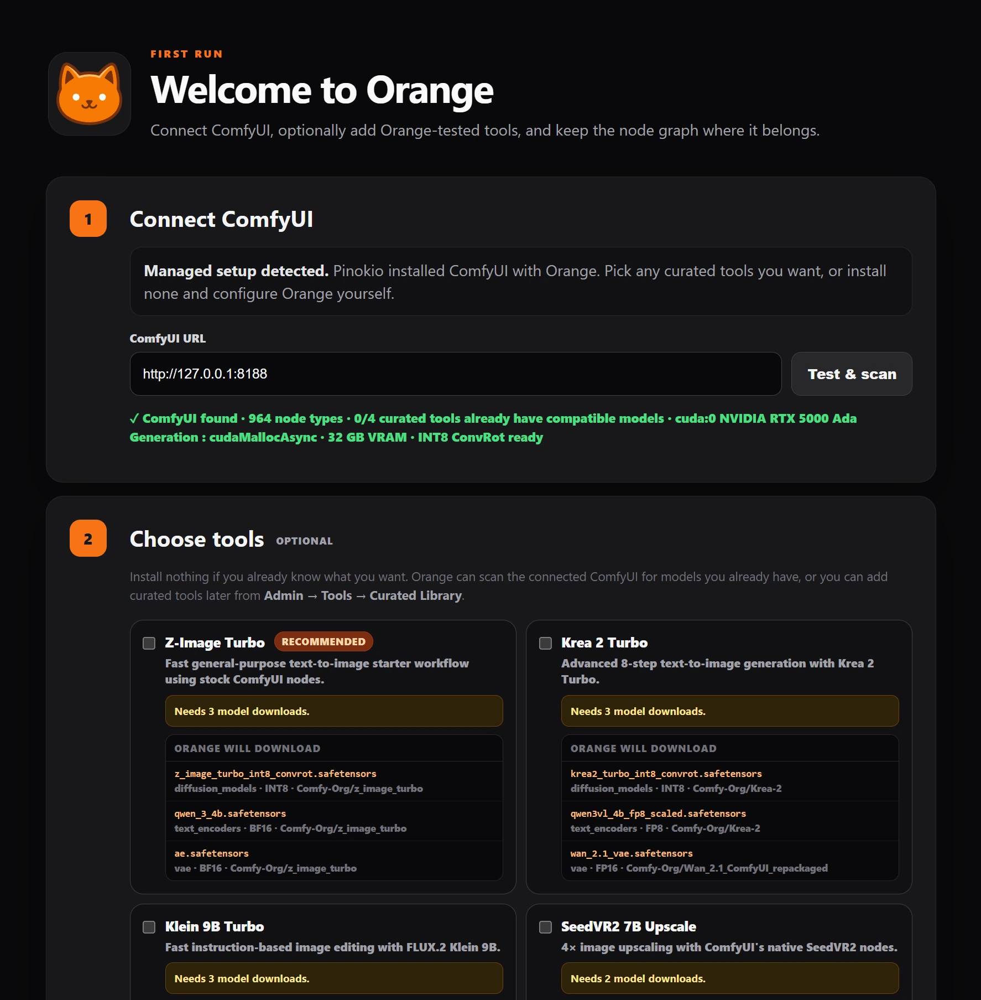
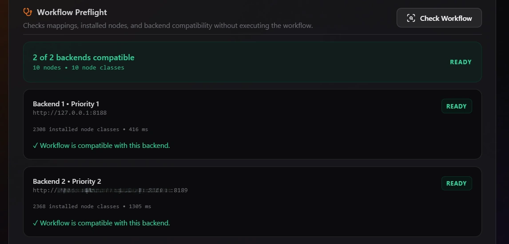
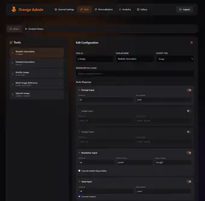
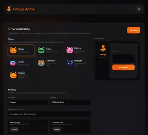
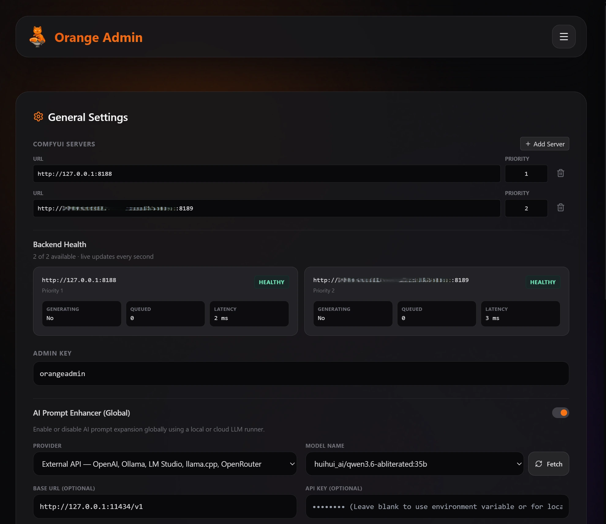

# Orange 😼

<p align="center">
  
</p>

Orange is a small web frontend for **ComfyUI**. It turns finished ComfyUI workflows into simple tools that people can use without seeing the node graph, model setup, or backend details.

> **Smarter internals, simpler surface.**

ComfyUI is where the workflow gets built. Orange is where people use it.

## Highlights

- **Simple generation UI.** Show people the controls they actually need, like a prompt, reference image, or aspect ratio.
- **Bring your own workflows.** Orange works with image generation, editing, upscaling, video, audio, and text workflows exported from ComfyUI.
- **Preflight and routing.** Check nodes, models, mappings, and assets before a tool is used, then route jobs to compatible ComfyUI backends.
- **Optional curated tools.** Orange includes a small set of tested workflows and can reuse compatible models that are already installed.
- **Prompt enhancement and personalization.** Add local or cloud LLM prompt enhancement, themes, and white-label branding when you want them.
- **Run it your way.** Connect to an existing ComfyUI setup, or use the Pinokio launcher to install Orange and ComfyUI together.

## Install

### Pinokio

The easiest all-in-one setup is the companion [Orange Pinokio launcher](https://github.com/saintbrodie/orange-pinokio).

It offers two install paths:

- **Orange + ComfyUI** installs and manages a local ComfyUI alongside Orange.
- **Orange Only** uses an existing ComfyUI from Stability Matrix, another manager, another machine, or a remote server.

Pinokio does not download workflow models up front. Orange checks the connected ComfyUI first and only installs missing files for tools you choose.

### Manual / GitHub

You need Python 3 and a reachable ComfyUI instance.

Clone the repository, then start Orange:

```text
Windows:     run.bat
Linux/macOS: ./run.sh
```

Open `http://localhost:7070/`.

The launchers create the Python environment, sync dependencies when needed, keep routine logs quiet, and show useful generation and LLM activity in the terminal. Set `ORANGE_VERBOSE_LOGS=1` if you want full live logs.

## First run

A fresh install opens a setup wizard. Orange connects to ComfyUI, scans the hardware, nodes, and model inventory, then lets you add curated tools or skip them entirely. Missing model downloads are shown before anything changes, and selected tools go through Workflow Preflight before they are exposed.

You can add curated tools later from **Admin → Tools → Curated Library**, or import your own API-format ComfyUI workflows.

## A quick look

<table border="0">
  <tr>
    <td align="center"><a href="docs/screenshots/setup.webp"></a></td>
    <td align="center"><a href="docs/screenshots/curated-library.webp"></a></td>
    <td align="center"><a href="docs/screenshots/preflight.webp"></a></td>
  </tr>
  <tr>
    <td align="center"><b>First-run setup</b></td>
    <td align="center"><b>Curated Library</b></td>
    <td align="center"><b>Workflow Preflight</b></td>
  </tr>
  <tr>
    <td align="center"><a href="docs/screenshots/tools.webp"></a></td>
    <td align="center"><a href="docs/screenshots/personalization.webp"></a></td>
    <td align="center"><a href="docs/screenshots/settings.webp"></a></td>
  </tr>
  <tr>
    <td align="center"><b>Tool Editor</b></td>
    <td align="center"><b>Personalization</b></td>
    <td align="center"><b>General Settings</b></td>
  </tr>
</table>

## Documentation

- [Architecture Overview](docs/ARCHITECTURE.md)
- [Adding Your Own Workflows](docs/adding_workflows.md)
- [Curated Workflow Packs](docs/WORKFLOW_PACKS.md)
- [Managed ComfyUI Lifecycle](docs/MANAGED_COMFYUI.md)
- [Managed Prompt Enhancement](docs/MANAGED_PROMPT_ENHANCEMENT.md)
- [Personalization & White-Label Branding](docs/PERSONALIZATION.md)

## Project direction

Orange should make ComfyUI easier to use without moving workflow-engineering decisions onto the people generating with it. New features should mostly improve onboarding, reliability, diagnostics, and workflow management instead of adding more technical controls to the Generate page.
